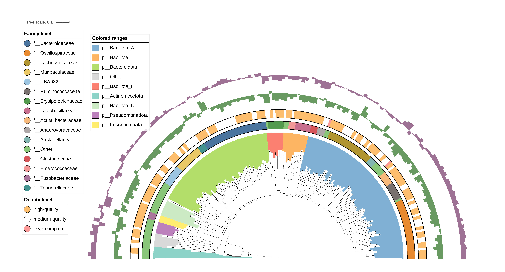

```{r setup, include=FALSE}
knitr::opts_chunk$set(echo = TRUE, warning = F, message = F)

```

## environment option

```{R message = F}
pacman::p_load(tidyr, dplyr, tibble, purrr, ggpubr, rstatix)
pacman::p_load(Maaslin2, ComplexHeatmap, tidygraph, ggraph)
source('/code/R_func/profile_process.R')
source('/code/R_func/difference_analysis.R')
source('/code/R_func/diversity.R')
source('/code/R_func/plot_PCoA.R')
source('/code/R_func/taxa.R')
source('/code/R_func/plot_stamp.R')
```

## input microbiota data

```{R}
group_level <- c('Mock','PDCoV')
group_color <- structure(c('#a0a0a4','#d7b0b0'), names = group_level)

group <- read.delim('group.tsv')

cvg <- read.delim('species.cvg', row.names = 1, check.names = F) %>% 
  apply(2, \(x) ifelse(x < .1, 0, 1))
profile <- cvg * read.delim('species.tpm', row.names = 1, check.names = F)
profile <- apply(profile, 2, \(x) x/sum(x) * 100) %>% 
  data.frame()

taxa <- read.delim('gtdbtk.tsv')

tr <- treeio::read.tree('faa_species.tre')
```

## MAGs phylogenetic tree



## alpha diversity

-   corresponding to Fig. S2A

```{R warning = F}
map(c('pd', 'shannon', 'richness'), ~
  calcu_alpha(profile, method = .x, tree = tr) %>% 
    left_join(group, by = 'sample') %>% 
    mutate(group = factor(group, group_level)) %>% 
    ggboxplot('group', 'value', fill = 'group', palette = group_color, 
            legend = 'none', outlier.size = 1, xlab = '', 
            ylab = paste0(.x, ' index')) +
    stat_compare_means(comparisons = list(group_level), label = 'p.signif', 
                       step.increase = .06, vjust = .7, tip.length = .02) +
    theme(aspect.ratio = 2) ) %>% 
  cowplot::plot_grid(plotlist = ., nrow = 1, align = 'v')

map_dfr(c('pd', 'shannon', 'richness'), ~
          calcu_alpha(profile, method = .x, tree = tr) %>%
          left_join(group, by = 'sample') %>% 
          mutate(name = .x) ) %>% 
  group_by(name) %>% 
  wilcox_effsize(value ~ group, ref.group = 'Mock')
```

## beta-diversity PCoA

-   corresponding to Fig. 1E

```{R message = F}
plot_PCoA(profile, group, group_level = group_level, group_color = group_color, 
          add_group_label = T, label_size = 3, ellipse_level = .8, 
          show_legend = F, show_grid = T, show_line = F)
```

## composition analysis

-   corresponding to Fig. S2B, 1F and 2A

```{R}
# custom palette
colors <- c('#8dd3c7','#ffffb3','#80b1d3','#b3de69','#fdb462','#bc80bd','#fb8072',
            '#ffed6f','#fccde5','#bebada','#e5c494','#ccebc5','#d9d9d9')
```

-   phylum, genus and species level composition analysis

```{R message=F, fig.width=15, fig.height=5}
map(c('phylum', 'genus', 'species'), ~ {
  .data <- taxa_trans(profile, taxa, group, to = .x, top_n = 12,
                      other_name = paste0(str_sub(.x, 1, 1), '__Other')) %>% 
    filter(!grepl('Unknown', rownames(.)))
  plot_compos_manual(.data, group, taxa_color = colors, group_level = group_level, 
                     plot_title = str_to_sentence(paste0(.x, ' level')),
                     out_all = T) +
    theme(aspect.ratio = 2.4) }) %>% 
  cowplot::plot_grid(plotlist = ., nrow = 1, align = 'v')
```

## difference microbes analysis

-   difference statistics

```{R}
# abundance
# p-value
data <- map(c('phylum', 'genus', 'species'), ~ {
  .data <- taxa_trans(profile, taxa, group, to = .x, out_all = T, transRA = T) 
  .ab <- .data %>% 
    profile_smp2grp(group) %>% 
    rownames_to_column('name') 
  .diff <- .data %>% 
    rownames_to_column('name') %>% 
    gather('sample', 'value', -name) %>% 
    left_join(group, by = 'sample') %>% 
    group_by(name) %>% 
    wilcox_test(value ~ group, comparisons = group_level, detailed = T) %>% 
    adjust_pvalue(method = 'BH') %>% 
    select(-.y., -n1, -n2, -statistic) %>% 
    mutate(enriched = ifelse(p < 0.05 & estimate > 0, 'Mock', 
                             ifelse(p < 0.05 & estimate < 0, 'PDCoV', 'none')))
  left_join(.ab, .diff, by = 'name')  } ) %>% 
  set_names(c('phylum', 'genus', 'species'))
# write.xlsx(data, 'taxa.compos.rela_ab.diff.xlsx')

# effect size
data <- map(c('phylum', 'genus', 'species'), ~ 
      taxa_trans(profile, taxa, group, to = .x, out_all = T, transRA = T) %>% 
      rownames_to_column('name') %>% 
      gather('sample', 'value', -name) %>% 
      left_join(group, by = 'sample') %>% 
      group_by(name) %>% 
      wilcox_effsize(value ~ group) ) %>% 
  set_names(c('phylum', 'genus', 'species'))
# write.xlsx(data, 'taxa.compos.rela_ab.diff.effect_size.xlsx')
```

-   phylum level visualization, corresponding to Fig. S2C

```{R fig.width=12, fig.height=9}
data <- taxa_trans(profile, taxa, group, to = 'phylum', out_all = T)
plot_taxa_boxplot(data, group, group_level = group_level, group_color = group_color, 
                  show_legend = F, legend_title = '', aspect_ratio = 2) %>% 
  cowplot::plot_grid(plotlist = ., nrow = 3, align = 'v')
```

-   genus level visualization, corresponding to Fig. 1G

```{R}
diff <- taxa_trans(profile, taxa, group, to = 'genus', out_all = T) %>% 
  difference_analysis(group, comparison = group_level, add_enriched = T)

plot_data <- diff %>% 
  mutate(.pval = -log10(pval),
         .PDCoV_ab = log(PDCoV_ab + 0.01),
         .Mock_ab = log(Mock_ab + 0.01),
         .label = ifelse(abs(log2FC) > 5 & pval < 0.03, name, ''))

ggscatter(plot_data, '.PDCoV_ab', '.Mock_ab', color = 'enriched', size = 'enriched',
            xlab = 'Log10 relative abundance in PDCoV',
            ylab = 'Log10 relative abundance in Mock',
            palette = c(group_color, 'none' = 'grey88')) + 
  geom_abline(slope = 1, intercept = 0, linetype = 'longdash') +
  scale_size_manual(values = c(2, 1.8, 2)) +
  geom_text(aes(label = .label), size = 1) +
  theme(aspect.ratio = 1)
```

## massalin2 microbial species analysis

-   corresponding to Fig. 2B barplot

```{R message = F, warning = F}
data <- taxa_trans(profile, taxa, to = 'species', out_all = T, transRA = T)

group <- read.delim('group.tsv') %>% 
  column_to_rownames('sample')

logging::setLevel('FATAL')
Maaslin2(data, group, output = 'taxa.masslin2.species', analysis_method = 'LM',
         normalization = 'NONE', transform = 'LOG', correction = 'BH', 
         fixed_effects = c('group'), save_models = T, save_scatter = T)

maaslin2_out <- read.delim('taxa.masslin2.species/all_results.tsv') %>% 
  mutate(feature = gsub('\\.', ' ', feature),
         feature = gsub('CAG ', 'CAG-', feature)) %>% 
  filter(pval < 0.05) %>% 
  mutate(enriched = ifelse(coef > 0, 'PDCoV', 'Mock'))

# 系数
coef_data <- maaslin2_out %>% 
  add_plab(by = 'qval') %>% 
  select(feature, coef, enriched, plab) %>%
  mutate(coef = abs(coef),
         feature = sub('CAG ', 'CAG-', feature)) %>% 
  arrange(coef) %>% 
  group_by(enriched) %>% 
  slice_tail(n = 10) %>% 
  ungroup() %>% 
  arrange(desc(enriched))
  
ggbarplot(coef_data, 'feature', 'coef', fill = 'enriched', rotate = T, 
          ylab = 'Coefficient', xlab = '', palette = group_color, 
          label = coef_data$plab, lab.vjust = .5, lab.size = 3, 
          lab.col = 'red') + 
  theme(aspect.ratio = 2)
```

-   corresponding to Fig. 2B heatmap

```{R}
plot_data <- data[rev(coef_data$feature),] %>% 
  profile_transRA()

row_data <- data.frame(feature = rownames(plot_data)) %>% 
  left_join(select(maaslin2_out, feature, enriched), by = 'feature')

col_data <- data.frame(sample = colnames(profile)) %>% 
  left_join(read.delim('group.tsv'), 'sample') %>% 
  select(sample, group)

row_annotation <- row_data %>% 
  column_to_rownames('feature')

annotation_colors <- list(enriched = group_color)

col_split <- factor(col_data$group)

pheatmap(plot_data, scale = 'row',
         color = colorRampPalette(c('#4575b4', '#f7f7f7', '#d73027'))(100),
         border = '#ffffff', border_gp = gpar(col = '#000000'),
         show_rownames = T, show_colnames = T,
         cellwidth = 12, cellheight = 12,
         column_split = col_split, 
         annotation_row = row_annotation,
         annotation_colors = annotation_colors,
         cluster_rows = F,
         show_row_dend = F, show_column_dend = F,
         fontsize_col = 10, fontsize_row = 10)
```

## input KO data

```{R}
group_level <- c('Mock','PDCoV')
group_color <- structure(c('#a0a0a4','#d7b0b0'), names = group_level)

group <- read.delim('group.tsv') %>% 
  select(sample, group)

ko_info <- read.delim('KO_level_A_B_C_D_Description', quote = '')
ko_tpm <- read.delim('KO.tpm', row.names = 1) %>% 
  filter(rowSums(.) != 0)
```

## KO sunburst

-   corresponding to Fig. S2D

```{R}
data <- ko_info %>% 
  filter(lvD %in% rownames(ko_tpm)) %>% 
  select(-lvD, -lvDdes) %>% 
  filter(lvAdes != 'Human Diseases') %>% 
  group_by(lvA, lvAdes, lvB, lvBdes, lvC, lvCdes) %>% 
  summarise(n = n()) %>% 
  ungroup()

# 旭日图
levels <- c('lvA', 'lvB', 'lvC')
colors <- c('#8dd3c7','#fb8072','#bebada','#80b1d3','#fdb462',
            '#b3de69','#fccde5')

plot_data <- data %>%
  mutate(lvA = lvAdes,
         lvB = lvBdes,
         lvC = lvCdes) %>% 
  select(lvA, lvB, lvC, n) %>% 
  group_by(lvA, lvB, lvC) %>% 
  arrange(lvA, lvB, lvC, desc(n)) %>% 
  mutate(lvA = paste0('A ', lvA),
         lvB = paste0('B ', lvB),
         lvC = paste0('C ', lvC))

plot_colors <- plot_data$lvA %>% 
  table(lvA = .) %>% 
  data.frame %>% 
  arrange(desc(Freq)) %>% 
  add_column(color = colors)

plot_colors <- plot_data %>% 
  left_join(select(plot_colors, lvA, color), by = 'lvA') %>% 
  gather(key = 'level', value = 'name', -n, -color) %>% 
  select(name, color) %>% 
  unique() %>% 
  pull(name = name)

plot_data %>% 
  gather(key = 'level', value = 'name', -n) %>%
  mutate(level = factor(level, unique(level)),
         name = factor(name, unique(name))) %>% 
  arrange(level, name) %>%
  group_by(level, name) %>%
  summarise(n = sum(n)) %>%
  ungroup() %>%
  group_by(level) %>%
  mutate(ymax = cumsum(n),
         ymin = lag(ymax, default = 0),
         xmax = as.numeric(level),
         xmin = xmax - 1,
         xpos = (xmax + xmin)/2, 
         ypos = (ymax + ymin)/2,
         prec = ypos / sum(plot_data$n),
         angle = -prec * 360,
         angle = ifelse(angle < 0 & angle > -180, angle + 90, angle - 90),
         label = ifelse(n > 200, gsub('\\w__', '', name), ''),
         label = gsub('[ABC] ', '', label)) %>% 
  ggplot() +
  geom_rect(aes(xmin = xmin, xmax = xmax, ymin = ymin, ymax = ymax, fill = name),
            color = 'white', linewidth = .1) +
  geom_text(aes(x = xpos, y = ypos, label = label, angle = angle), size = 2.2) +
  scale_fill_manual(values = plot_colors) +
  labs(caption = 'A total of 7,004 KOs') +
  coord_polar(theta = 'y') +
  theme_void() +
  theme(legend.position = 'none')
```

## KO alpha-diversity

-   corresponding to Fig. 1H and 1I

```{R}
map(c('shannon', 'richness'), ~
      calcu_alpha(ko_tpm, method = .x) %>% 
      left_join(group, by = 'sample') %>% 
      mutate(group = factor(group, group_level)) %>% 
      ggboxplot('group', 'value', fill = 'group', palette = group_color, 
                legend = 'none', outlier.size = 1, xlab = '', 
                ylab = paste0(.x, ' index')) +
      stat_compare_means(comparisons = list(group_level), label = 'p.signif', 
                         step.increase = .06, vjust = .7, tip.length = .02) +
      theme(aspect.ratio = 2) ) %>% 
  cowplot::plot_grid(plotlist = ., nrow = 1, align = 'v')

# effect size
map_dfr(c('shannon', 'richness'), ~
          calcu_alpha(profile, method = .x) %>%
          left_join(group, by = 'sample') %>% 
          mutate(name = .x) ) %>% 
  group_by(name) %>% 
  wilcox_effsize(value ~ group, ref.group = 'Mock')
```

## KO beta-diversity PCoA

-   corresponding to Fig. 1J

```{R}
plot_PCoA(ko_tpm, group, group_level = group_level, group_color = group_color, 
          add_group_label = T, label_size = 3, ellipse_level = .9, 
          show_legend = F, show_grid = T, show_line = F)
```

## KO level B visualization and analysis

-   corresponding to Fig. S2E

```{R}
path_tpm <- ko_tpm %>% 
  mutate(lvBdes = ko_info$lvBdes[match(rownames(.), ko_info$lvD)]) %>% 
  aggregate(. ~ lvBdes, ., sum) %>% 
  column_to_rownames('lvBdes')

diff <- difference_analysis(path_tpm, group, add_enriched = T,
                            comparison = c('PDCoV', 'Mock')) %>% 
  mutate(category = ko_info$lvAdes[match(name, ko_info$lvBdes)], .after = 1)

data <- path_tpm %>% 
  rownames_to_column('name') %>% 
  gather('sample', 'value', -name) %>% 
  left_join(group, by = 'sample') %>% 
  group_by(name) %>% 
  wilcox_effsize(value ~ group)

head(data)

row_data <- data.frame(name = rownames(path_tpm)) %>% 
  mutate(lvAdes = ko_info$lvAdes[match(name, ko_info$lvBdes)]) %>% 
  filter(lvAdes %in% c('Metabolism','Environmental Information Processing',
                       'Cellular Processes', 'Genetic Information Processing',
                       'Organismal Systems','Brite Hierarchies'))
col_data <- data.frame(name = colnames(path_tpm)) %>% 
  left_join(group, by = c('name' = 'sample'))

row_annotation <- row_data %>% column_to_rownames('name')
col_annotation <- col_data %>% column_to_rownames('name')

colors <- list(lvAdes = structure(c('#a6cee2','#b1df89','#fa9a99','#c9b1d5',
                                    '#fcc681','#fccde5'),
                                  names = unique(row_data$lvAdes)),
               group = group_color)

row_split <- factor(row_annotation$lvAdes)
col_split <- factor(col_annotation$group)

data <- filter(path_tpm, rownames(path_tpm) %in% row_data$name)

pheatmap(data, scale = 'row',
         color = paletteer::paletteer_c('grDevices::Temps', 30),
         split = row_split, column_split = col_split,
         column_gap = unit(1, 'mm'), row_gap = unit(1, 'mm'),
         cluster_rows = T, cluster_cols = T,
         border_color = 'white', border_gp = gpar(col = 'black'),
         show_rownames = T, show_colnames = F,
         cellwidth = 12, cellheight = 8,
         treeheight_col = 30, treeheight_row = 30,
         fontsize_col = 8,  fontsize_row = 7,
         annotation_col = col_annotation, annotation_row = row_annotation,
         annotation_colors = colors, annotation_names_col = T)
```

-   corresponding to Fig. 1K

```{R}
data <- calcu_stamp(path_tpm, group, comparison = c('PDCoV', 'Mock'), method = 'wilcox')

.names <- diff %>% 
  filter(category %in% c('Cellular Processes','Metabolism',
                         'Environmental Information Processing',
                         'Genetic Information Processing')) %>% 
  pull(name)

filter(data, padj < 0.05 & name %in% .names) %>% 
  add_plab(by = 'padj') %>% 
  plot_stamp(top_n = 100, comparison = c('PDCoV', 'Mock'), 
             palette = c('#d7b0b0', '#a0a0a4'), left_title = '', 
             left_xlab = 'mean TPM', middle_title = '', 
             middle_xlab = '95% confidence intervals\nestimate of the location parameter')
```

## BSH BaiCD metagenomic abundance analysis

-   corresponding to Fig. 3A

```{R}
group <- read.delim('group.tsv')

ko_tpm[c('K01442', 'K15870'),] %>% 
  t %>% 
  data.frame() %>% 
  rownames_to_column('sample') %>% 
  left_join(group, by = 'sample') %>% 
  select(-sample) %>% 
  filter(!is.na(group)) %>% 
  gather('gene', 'value', -group) %>% 
  ggboxplot('group', 'value', fill = 'group', palette = group_color, legend = 'none') +
  facet_wrap(~ gene, scale = 'free') +
  stat_compare_means(comparisons = list(group_level), method = 'wilcox', 
                     label = 'p.signif') +
  theme(aspect.ratio = 1.8,
        strip.background = element_blank())

ko_tpm[c('K01442', 'K15870'),] %>% 
  t %>% 
  data.frame() %>% 
  rownames_to_column('sample') %>% 
  left_join(group, by = 'sample') %>% 
  filter(!is.na(group)) %>% 
  select(-sample) %>% 
  gather('gene', 'value', -group) %>% 
  group_by(gene) %>% 
  wilcox_test(value ~ group)

ko_tpm[c('K01442', 'K15870'),] %>% 
  t %>% 
  data.frame() %>% 
  rownames_to_column('sample') %>% 
  left_join(group, by = 'sample') %>% 
  filter(!is.na(group)) %>% 
  select(-sample) %>% 
  gather('gene', 'value', -group) %>% 
  group_by(gene) %>% 
  wilcox_effsize(value ~ group)
```

## correlation analysis with viral loads

-   corresponding to Fig. 2C

```{R}
metadata <- read.delim('viral_loads.txt', row.names = 1)

group <- read.delim('group.tsv')

cvg <- read.delim('species.cvg', row.names = 1, check.names = F) %>% 
  apply(2, \(x) ifelse(x < .1, 0, 1))

profile <- cvg * read.delim('species.tpm', row.names = 1, check.names = F)

profile <- apply(profile, 2, \(x) x/sum(x) * 100) %>% 
  data.frame() %>% 
  select(all_of(group$sample))

taxa <- read.delim('gtdbtk.tsv')

.names <- read.delim('taxa.masslin2.species/all_results.tsv') %>% 
  filter(pval < 0.05) %>% 
  mutate(enriched = ifelse(coef > 0, 'PDCoV', 'Mock'),
         feature = gsub('\\.', ' ', feature),
         feature = gsub('CAG ', 'CAG-', feature),
         coef = abs(coef)) %>% 
  arrange(coef) %>% 
  group_by(enriched) %>% 
  slice_tail(n = 10) %>% 
  ungroup %>% 
  pull(feature)

data <- taxa_trans(profile, taxa, to = 'species', out_all = T) %>% 
  filter(rownames(.) %in% .names)

corr <- psych::corr.test(t(data), metadata, adjust = 'BH')

r_data <- data.frame(t(corr$r), check.names = F) %>% 
  rownames_to_column('name') %>% 
  gather('taxa', 'rval', -name)
p_data <- data.frame(t(corr$p), check.names = F) %>% 
  rownames_to_column('name') %>% 
  gather('taxa', 'pval', -name) %>% 
  mutate(padj = p.adjust(pval, 'BH'))

plot_data <- cbind(r_data, select(p_data, pval, padj))

# graph
edges <- plot_data %>% 
  filter(padj < 0.05) %>% 
  select(from = name, to = taxa, rval) %>% 
  mutate(direct = ifelse(rval < 0, 'neg', 'pos'),
         rval = abs(rval))
nodes <- data.frame(node = unique(c(edges$from, edges$to))) %>% 
  mutate(type = ifelse(grepl('s__', node), 'taxa', 'virus'),
         phylum = ifelse(type == 'taxa', taxa$phylum[match(node, taxa$species)], ''))

g <- tbl_graph(nodes = nodes, edges = edges)

colors <- c('#8dd3c7','#bebada','#fb8072','#80b1d3','#fdb462',
            '#b3de69','#fccde5','#bc80bd','#ffed6f','grey77')

ggraph(g, layout = 'linear', circular = T) +
  geom_edge_arc(aes(edge_width = rval, edge_linetype = direct, 
                    edge_colour = direct), strength = .2) +
  scale_edge_linetype_manual(values = c(2, 1)) +
  scale_edge_width(range = c(.5, .8)) +
  scale_edge_color_manual(values = c('#7fc97f','#fdc086')) +
  geom_node_point(aes(color = phylum, shape = type), size = 3) +
  scale_shape_manual(values = c(16, 15)) +
  scale_color_manual(values = colors) +
  geom_node_text(aes(label = node), size = 2) +
  theme_void() +
  theme(aspect.ratio = 1)
```
